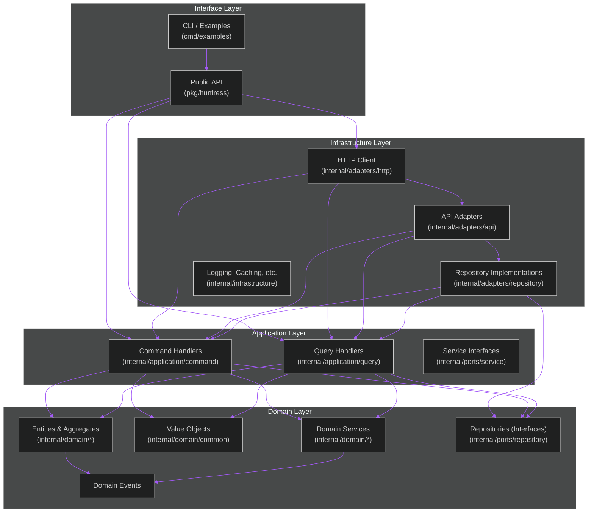

# Bishoujo-Huntress: Huntress API Go Client Architecture

## Overview

Bishoujo-Huntress is a comprehensive Go client library for the Huntress API, designed following Domain-Driven Design (DDD), Command Query Responsibility Segregation (CQRS), and Clean Architecture principles. This document outlines the architectural decisions, component interactions, and design patterns implemented in the library.

## Core Architecture Principles

This library implements a clean architecture approach with clear separation of concerns:

1. **Domain Layer**: Contains the core business logic and entity definitions
2. **Application Layer**: Implements use cases through commands and queries
3. **Infrastructure Layer**: Handles external concerns like HTTP communication and authentication
4. **Interface Layer**: Provides a clean API for end users

## Component Architecture

## Domain Model

The domain model reflects the core entities in the Huntress API:

1. **Account**: Represents a Huntress account
2. **Organization**: Represents customer organizations within an account
3. **Agent**: Represents installed Huntress agents on endpoints
4. **IncidentReport**: Security incidents detected by Huntress
5. **SummaryReport**: Generated reports for accounts/organizations
6. **BillingReport**: Billing information for accounts

Each domain entity encapsulates its own business rules and validation logic.

## Application Services

Application services are organized using the CQRS pattern:

### Commands

Commands represent actions that modify state:

- **CreateX**: Creates new entities
- **UpdateX**: Updates existing entities
- **DeleteX**: Deletes entities (when applicable)

### Queries

Queries retrieve data without modifying state:

- **GetX**: Retrieves a single entity by ID
- **ListX**: Retrieves multiple entities with optional filters
- **SearchX**: Searches for entities based on criteria

## Infrastructure Layer

The infrastructure layer handles technical concerns:

1. **HTTP Client**: Communicates with the Huntress API
   - Implements retry logic, timeouts, and error handling
   - Handles rate limiting (60 requests per minute)
   - Manages pagination for list endpoints

2. **Authentication**: Manages API credentials
   - Securely stores and applies authentication headers
   - Implements Basic Authentication as required by Huntress API

3. **Serialization**: Handles JSON parsing and validation
   - Converts between domain entities and API DTOs
   - Implements validation for request/response data

## Error Handling

The library implements a comprehensive error handling strategy:

1. **Domain Errors**: Represent business rule violations
2. **Application Errors**: Wrap domain errors with context
3. **Infrastructure Errors**: Technical errors like network failures
4. **API Errors**: Errors returned by the Huntress API

Error types are designed to be informative while preserving the original error context.

## Thread Safety

The library is designed to be thread-safe:

1. All client operations can be safely called concurrently
2. Internal state is protected with appropriate synchronization
3. Immutable data structures are used where possible

## Environmental Concerns

The library addresses several environmental concerns:

1. **Authentication**: Secure handling of API credentials
2. **Performance**: Efficient use of network resources
3. **Resilience**: Robust handling of API rate limits and transient errors
4. **Observability**: Logging and metrics for monitoring

## Security Considerations

Following OSSF security baselines:

1. **Credential Handling**: No hardcoded credentials
2. **Input Validation**: Validation of all inputs
3. **Error Handling**: Proper error handling without leaking sensitive information
4. **Dependency Management**: Minimal use of external dependencies

## Extensions and Future Development

The architecture is designed to be extensible:

1. **Additional Resources**: New API endpoints can be added following the established patterns
2. **Alternative Transports**: The core domain logic is independent of HTTP transport
3. **Mock Implementations**: Interfaces allow for easy testing with mock implementations
